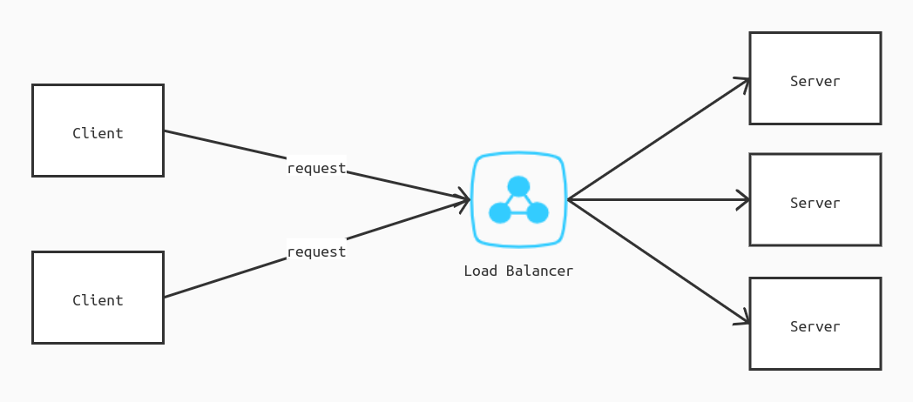
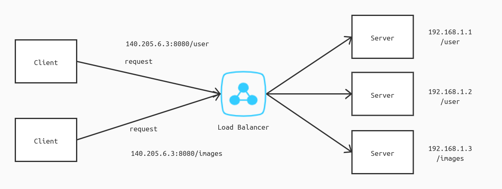
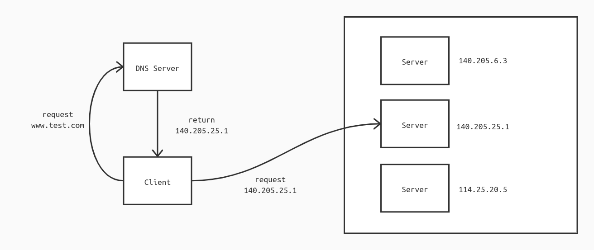

# 负载均衡

## 什么是负载均衡

传统的 Client/Server 架构，客户端向服务端发起请求，服务端返回请求。

```
+-----------+                        +-----------+
|           |         Request        |           |
|  Client   |  +------------------>  |   server  |
|           |  <-------------------  |           |
+-----------+         Response       +-----------+
```

但是一般而言服务端只有一个，而客户端却有多个，基本上一个用户一个客户端，那么这样说来，在同一段时间内，服务端都要处理来自复数个客户端的请求。也许用户不多时，业务能够很顺利地运行，但一旦用户数大到一定的量级，或是在特定的同一时间内发起请求（如高校抢课、双十一），那么服务器要想一个个处理来请求，就恐怕很难了。


那么一旦服务端难以处理来自客户端的请求时会发生什么？一般而言就是客户端一直在请求、加载，然后要么很慢才得到响应，要么就是请求和加载失败，导致用户得到非常差的体验。当然这还是比较好的情况，最坏的情况就是服务器承受不了压力，崩了，这样用户就完全请求不到内容了。（最最严重的线上事故）

既然出现了问题，那么就要想办法去解决。问题在于服务器无法在同一时间内同时处理来自客户端的大量请求。解决问题的思路就是想办法为服务器降低单位时间内的客户端流量，那么简单，增加服务器就行了，安排多个服务器来分担流量的压力（多服务器涉及到分布式的范畴，要有一个主服务器或专门的 Gateway 网关来负责流量转发）。

但是，问题又出现了，如果其中一个服务器压力很大，而其它的服务器都很空闲怎么办？万一网络还是很“固执”将请求发送到那个十分忙碌的服务器怎么办？结果自然还是重新回到刚开始的那个情况。甚至当一个服务器宕机怎么办？要知道客户端可不知道服务器是不是宕机了的，还是照样请求。理所当然的，在这种情况下，就需要一个中间方来做协调，中间方需要先检查服务器的状态，再负责流量的转发。而个中间方起到的作用就是负载均衡。



那么什么是负载均衡？

负载均衡是一种能够将网络流量**均衡**分配到各个服务器上，以减少单个服务器压力、提升整体性能的技术。这里的“均衡”并不是平均分配的意思，而是根据服务器的硬件性能（CPU、带宽等）和当前负载状况进行较为合理的分配。比如某个服务器压力大就选择较为其它空闲的服务器分配，某个服务器承受能力强、性能高，就多多担当。

客户端与服务器组之间有一个专门的中间方，称为负载均衡器（load balancer），它专门负责流量转发。它在转发前，会根据其特定的负载均衡算法，选择合适的服务器。

## 应用分类

负载均衡技术目前主要可分为以下几类：

+   二层负载均衡
+   三层负载均衡
+   **四层负载均衡**
+   **七层负载均衡**
+   **DNS 负载均衡**

其中四层、七层负载均衡和DNS负载均衡是最主要的。

### 四层负载均衡

四层负载均衡就是指在 OSI 模型中第四层传输层上的负载均衡，它基于 IP 地址和端口号。

它主要是通过报文中的目标 IP 地址和端口，再加上负载均衡器设置的服务器选择方式，决定最终选择的内部服务器。


要注意的是，负载均衡器接收到的 IP 地址是虚拟 IP，不是某个服务器的 IP 地址，负载均衡器需要将虚拟 IP 转换为真实 IP，转发到对应的服务器。即客户端认为它发送请求给了某个特定的服务器，但实际上并不是，负载均衡器会根据选择将其请求转发给不同的服务器来处理，也就是说，在同一时间内发送的两条相同请求，可能是被不同的服务器来处理的。负载均衡屏蔽了客户端的感知，这体现了一个透明性。

基本调度方式有轮询调度和最小连接数调度。

应用：LVS（Linux Virtual Server）

### 七层负载均衡

同样，七层负载均衡对应着第七层的应用层。

七层负载均衡也被称为“内容交换”，基于 URL 等应用层信息，主要通过如 HTTP 等应用层协议头中的信息和消息中的真实内容，再加上负载均衡器设置的服务器选择方式，决定最终的内部服务器。如根据 URL 中的 path 或 header 中的 `Content-Type`，选择或重定向到指定服务器。



优点：

+   更加灵活。能根据请求的数据类型（如视频、文本、图片），选择合适或专门的服务器来处理
+   更加安全。负载均衡相当于在客户端和服务器之间隔了一道过滤层，对于如 SYN 泛洪攻击的攻击，可以将危险阻碍在服务器之外，不会让内部服务器收到影响。

如果要根据应用层的请求类型来确定内部服务器，那么需要在客户端与服务器之间建立 TCP 连接之后，才能够收到真正的报文内容，来确定服务器。但是如果只是客户端和服务器之间建立连接，那么当要更换服务器时，就无法实现。所以在这种情况下，负载均衡器会分别和客户端、服务器建立独立的 TCP 连接，类似于代理服务器。

缺点：性能要求更高、在时间和计算能耗上较弱

调度方式：轮询调度、最小连接数调度、域名调度、URL 调度

应用：Ngnix

## 二层负载均衡

同样，二层负载均衡就是在第二层的数据链路层进行的负载均衡技术。

它是基于 MAC 地址的，客户端请求的是虚拟的 MAC 地址，负载均衡器需要转换为真实的 MAC 地址，并将 MAC 帧转发到目的 MAC 地址对应的服务器上。

优点：

+   不需要负载均衡服务器进行地址的转换。
+   数据响应时不需要经过负载均衡服务器。

 缺点：负载均衡服务器的网卡带宽要求较高。

## 三层负载均衡

三层负载均衡是在第三层网络层进行的。

它基于 IP 地址，负载均衡器需要修改 IP 数据报上的目的地址，修改为内部服务器的 IP 地址。

优点：在响应请求时速度较反向服务器负载均衡要快。

缺点：当请求数据较大（大型视频或文件）时，速度较慢。

### DNS 负载均衡

DNS 负载均衡是最早应用的负载均衡技术。

在 DNS 服务器中为一个域名配置多个 IP，查询这个域名时会被分配到其中一个 IP 地址，从而使得不同的客户端访问不同 IP 地址的服务器，达到负载均衡的目的。



在这里，DNS 服务器就充当了负载均衡器的角色，但由于 DNS 的特性，它不负责转发流量，只是将 IP 地址告知客户端，让客户端去请求这个真正的 IP 地址。

例如，同一个域名 `www.baidu.com` 对应着多个不同的 IP 地址，在本机查询 IP：

```shell
$ host www.baidu.com
www.baidu.com is an alias for www.a.shifen.com.
www.a.shifen.com has address 182.61.200.7
www.a.shifen.com has address 182.61.200.6
```

注：百度的 IP 不止以上两个，在不同时间不同地点查询到的 IP 可能是不一样的，猜测在每个地域都有其服务器镜像。

优点：配置最简单，应用广泛

缺点：不能区分服务器的差异，不能反映服务器的当前运行状态


>   在我看来，DNS 严格来说应该不能算负载均衡技术。
>
>   因为负载均衡技术需要根据各服务器节点的状况，而安排合适的流量，以达到“均衡”的目的，主要起到的是一个调度的作用；而 DNS 只是负责流量转发，不能识别服务器的运行状态，也没有调度算法，因而起到的只是一个连通作用，是从单服务器变为多服务器的一项技术应用。
>
>   例如当某个服务器宕机了，那 DNS 还是会安排流量到该节点上，除非另外加一个健康检查，但这也不属于 DNS 的职能。
>
>   所以个人认为 DNS 负载均衡应该不能严格算是负载均衡技术，但是因为无论是维基百科还是一些书籍都把它列上，所以也先写在此处。


## 负载均衡算法

负载均衡算法可以分为两类：静态负载均衡算法和动态负载均衡算法。

静态负载均衡算法以固定的概率分配任务，不考虑服务器的状态信息，如：轮询算法（Round Robin）、随机法。

动态负载均衡算法以服务器的实时负载状态信息来决定任务的分配，如：最小连接数算法（Least Connections）、最快响应速度。

