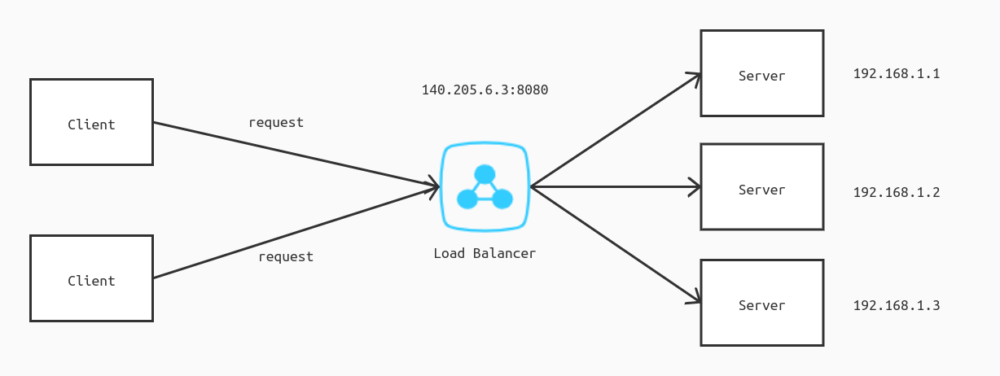

# Load balancing

It is divided into this three parts: the first is that what is load balancing, the second is application, and the third is the algorithm.

## What is load balancing?

Well, what is load balancing? Let us look at this picture first.

It is well-known that the client/server architecture works like this: client send requests to the server and then the server return response  back. It is the most simple and tradictional architecture in the network.


In this picture, the server is requested by just two clients. But in fact, the server has to handle multiple requests at the same time. When clients are not so many, the program may run smoothly and successfully. However, once the number of users reaches a certain level, or a large amount of requests are sent at the same time, it is awfully difficult for the server to process the requests one by one, such as in the course selection period or at the double 11 shopping festival, that is, tomorrow. You could hardly imagine the server's situation when it receives millions of requests in a second.


So what would happen when the server has trouble in handling the requests? Generally speaking, the client would send requests and load pages all the time, and then either gets a response very slowly, or fails to load pages, resulting in a very poor user experience to users. Of course it is very normal and not so bad. The worst situation is that the server can't bear the pressure and finally be done, so that users can't get anything, which is the most serious online accident.

How to resolve the problem? Use the load balancing.

What is the load balancing?

Load balancing refers to the process of distributing a set of tasks over a set of servers, with the aim of reducing the pressure of a single server and improving the overall performance.

The "balance" here does not mean average distribution, but a more reasonable distribution according to the hardware performance (CPU, bandwidth, etc.) and the current load condition. For example, if a server is under great pressure, it will choose another idle server. If a server has strong capacity to take pressure and high performance, it will take on more responsibilities.

There is a special intermediary between clients and servers, called load balancer, which is responsible for traffic forwarding. Before forwarding, it will select the appropriate server according to its specific load balancing algorithm.

## Classification

At present, load balancing technology can be divided into the following categories:

+   Layer 4 load balancing
+   Layer 7 load balancing
+   Layer 2 load balancing
+   Layer 3 load balancing
+   DNS load balancing

Among them, the layer 4 load balancing, the layer 7 load balancing and the DNS load balancing are the most important.

### Layer 4 load balancing



Layer 4 load balancing refers to the load balancing on the fourth layer, the transport layer in OSI model, which is based on IP address and port number.

It mainly determines the final internal server through the target IP address and port in the message and the server selection mode set by the load balancer.

It should be noted that the IP address received by the load balancer is a virtual IP, not an real IP of a server. The load balancer needs to convert the virtual IP into a real IP and forward it to the corresponding server. In other words, the client thinks that it has sent a request to a specific server, but it is not. The load balancer will forward its request to different servers. In other words, two same messages sent at the same time may be processed by two different servers.

Application: LVS(Linux Virtual Server)

### Layer 7 load balancing

The layer 7 load balancing corresponds to the the application layer, the seventh layer in OSI model.

Layer 7 load balancing is based on the application layer information such as URL. It mainly determines the internal server through the information in the header of an application layer protocol such as HTTP and the real content in the message. 


Advantage: 

+   more flexible. According to the requested data type (such as video, text, picture), select appropriate or special server to process.
+   more safe.

Disadvantages: higher performance requirements, long time consuming and high calculation energy consumption

Application: Ngnix

### DNS load balancing

DNS load balancing is the earliest application of load balancing technology. Because of its simplicity, it is still widely used in the world.

The core point is that a domain name corresponds to multiple IP addresses

When querying this domain name, it will be assigned to one of the IP addresses, so that different clients can not access it the same IP address of the server, to achieve the purpose of load balancing.


Here, the DNS server acts as a load balancer. However, due to the characteristics of DNS, it is not responsible for forwarding traffic, but only informs the client of the IP address and asks the client to request the real IP address.

For example, the same domain name ` www.baidu.com `Corresponding to different IP addresses, query IP address in the local machine:

```shell
$ host www.baidu.com
www.baidu.com is an alias for www.a.shifen.com.
www.a.shifen.com has address 182.61.200.7
www.a.shifen.com has address 182.61.200.6
```

Advantages: the most simple configuration, widely used

Disadvantages: can't distinguish the differences between servers and reflect the current running state of servers

### ~~Layer 2 load balancing~~

~~Similarly, the second layer load balancing is a load balancing technology at the data link layer of the second layer.~~

~~It is based on MAC address. The client requests virtual MAC address. Load balancer needs to convert to real MAC address and forward MAC frame to the destination MAC address corresponds to the server.~~

~~advantage:~~

+   ~~Load balancing server is not required for address conversion.~~
+   ~~Data response does not need to go through load balancing server.~~

~~Disadvantages: the network card bandwidth of load balancing server is required to be high.~~

### ~~Layer 3 load balancing~~

~~The load balancing of the third layer is carried out at the third layer network layer.~~

~~It is based on IP address, load balancer needs to modify the destination address on IP datagram and modify it to IP address of internal server.~~

~~Advantage: faster response to requests than reverse server load balancing.~~

~~Disadvantages: slow when large data (large video or file) is requested.~~

## Load balancing algorithm

Load balancing algorithm can be divided into two categories: static load balancing algorithm and dynamic load balancing algorithm.

Static load balancing algorithm distributes tasks with a fixed mode, without considering the status information of the server, such as round robin and randomized static.

Dynamic load balancing algorithm uses the real-time load status information of servers to distribute tasks, such as the least connections algorithm and the fastest response speed.

