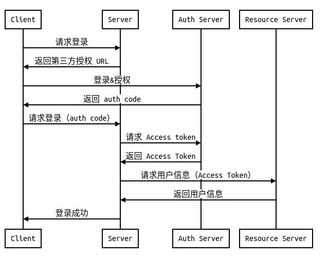

# OAuth 2.0 随便聊聊

## What is OAuth?

在传统的应用中，客户端是通过完全持有**资源所有者**（即用户）的**凭证**（账号密码）的条件下，进行服务器上资源的访问的，但是如果要接入第三方平台，即允许第三方应用访问该服务器上的资源时，就会出现一些问题，如：

+   第三方应用就被允许获取与**存储**请求的凭证（用户名密码）；
+   第三方应用具有**全部的权限**去访问服务器上的资源；
+   资源所有者不能有效**撤销**对第三方应用的访问许可，只能通过改变密码的方式一刀切；
+   第三方应用数据的泄露会导致用户密码的**泄露**。

本质上来说，无论用户还是资源服务器，对第三方应用都只是部分信任的，需要确保自身的数据和资源的安全问题。

为解决如上问题，OAuth 应运而生，OAuth（Open Authorization），是一个开放认证协议，它允许用户以第三方应用获取该用户在某一网站的受保护资源，而无需提供用户名与密码，通常来说就是常见的第三方登录。

那么应用了 OAuth，如何解决上面的问题？

+   使用 Access Token 该凭证访问服务器资源，而非账号密码，token 具有过期时间；
+   设置 scope 权限范围，限制可访问的资源，如 QQ 授权时的获取个人信息、创建用户等权限；
+   对需要撤销许可的应用，可以通过删除 token 或设置 scope 等方法，有效撤销授权许可，而不会”杀敌一千自损八百“；
+   第三方应用只会保存 token，token 的泄露不会对本应用资源服务器造成太大的影响。

### Roles

OAuth 中定义了四类角色：

+   client：客户端，请求资源的一方；
+   resource owner：能够给予授权的资源所有者，通常为用户；
+   resource server：资源服务器，拥有资源的一方；
+   authorization server：认证服务器，校验授权凭证，发放资源请求凭证（access token）等。

### Protocol Flow

```txt
     +--------+                               +---------------+
     |        |--(A)- Authorization Request ->|   Resource    |
     |        |                               |     Owner     |
     |        |<-(B)-- Authorization Grant ---|    (User)     |
     |        |                               +---------------+
     |        |
     |        |                               +---------------+
     |        |--(C)-- Authorization Grant -->| Authorization |
     | Client |                               |     Server    |
     |        |<-(D)----- Access Token -------|               |
     |        |                               +---------------+
     |        |
     |        |                               +---------------+
     |        |--(E)----- Access Token ------>|    Resource   |
     |        |                               |     Server    |
     |        |<-(F)--- Protected Resource ---|               |
     +--------+                               +---------------+
```

1.  客户端向用户请求授权；
2.  用户给予授权；
3.  客户端向认证服务器（Authorization Server）申请令牌 Access Token；
4.  Authorization Server 认证无误以后，发放令牌 Access Token；
5.  客户端使用 Access Token 向资源服务器（Resource Server）进行资源请求（如用户信息）；
6.  Resource Server 确认令牌有效，返回请求的资源。

无论是 OAuth 的哪个授权模式，都逃不过这基本的流程。

## Authorization Grant

客户端需要通过授权（Authorization Grant），才可以得到 Access Token；OAuth 2.0 定义了四种授权方式：

+   Authorization Code（授权码模式）：前后端分离应用，借助 Auth Code 获取 Access Token；
+   Implicit（隐式模式）：直接用客户端获取凭证，跳过应用的服务器；
+   Resource Owner Password Credentials（密码模式）：使用用户名和密码，获取凭证；
+   Client Credentials（客户端凭证模式）：无需用户授权，直接通过客户端本身获取凭证。

## Authorization Code

>   授权码模式是功能最完整、流程最严密的授权模式。

### 流程



1.  客户端向服务端请求登录
2.  服务端返回第三方登录服务器 URL（或是重定向）
3.  客户端向第三方认证服务器请求（登录）授权
4.  成功登录且授权，认证服务器返回 auth code
5.  客户端携带 auth code 向服务端请求登录
6.  服务端向认证服务器请求获取 access token
7.  认证成功，返回 access token
8.  服务端拿着 access token 向第三方资源服务器请求用户信息
9.  access token 校验成功，资源服务器返回用户信息
10.  登录成功

>   具体的流程，根据个人的理解，都会有一些出入，比如重定向，就没有采用。

## 实现 OAuth 服务器

>   以 Authorization Code 模式为例

### OAuth server framework

首先最好有一个比较成熟的框架。

一个 OAuth2.0 服务器框架需要具备的模块：

+   generate：code、token、refresh token 的生成，以及必要的有效校验等方法；
+   storeage：负责 token 相关和 client 部分的存储（数据库 or 内存）；
+   其它：设置，token、client 的管理、重定向……

>   Golang 中较为成熟的框架：https://gopkg.in/oauth2.v4

### 需要实现的方法

>   未使用重定向方法，省去了 return uri

#### 注册客户端

客户端需要预先注册，获取 client_id 和 client_secret （QQ、微信等称为 appid 和 secret），在之后请求 auth code、access token 等都要带上。

比如要获取接入 github oauth，需要先在该[网址](https://github.com/settings/applications/new)中注册客户端。

注册客户端就只是需要生成 client_id 和 client_secret，并和 URL、return url 存储起来即可。

#### 授权、授权码

任务：

+   登录
+   授权
+   生成授权码

请求参数（必备）：

+   grant_type。授权模式（Authorization code）。
+   client_id
+   scope。权限范围，如只读权限、获取用户信息权限等。设置 scope 可以限制第三方应用的访问权限，只能访问特定的资源。

返回：

+   auth code
+   expired。过期时间

#### get access token

任务：

+   删除 auth code。auth code 只能使用一次
+   生成/获取 access token、refresh token

请求参数（必备）：

+   grant_type。不同的授权模式有判断条件。如 Authorization code 需要校验 auth code。
+   client_id
+   client_secret
+   auth code
+   scope

返回：

+   access token
+   refresh token
+   access token 的过期时间
+   refresh token 的过期时间

#### refresh access token

任务：

+   生成新的 access token
+   更新 refresh token 过期时间 / 生成新的 refresh token

请求参数（必备）：

+   client_id
+   client_secret
+   scope

返回参数：

+   access token
+   refresh token
+   access token 的过期时间
+   refresh token 的过期时间

## Q&A

#### 为什么需要 refresh token 来更新 access token，而不是直接延长 access token 的有效期？

主要是为了两者的职责分离。

refresh token 是用来从 auth server 中请求新的 access token，而 access token 是用来从 resource server 中请求受保护的资源；前者负责身份认证，后者负责请求资源，两者的任务是不同的。

严格来说，Auth Server 和 Resource Server 是不同的，所以对 refresh token 和 access token 来说，两者请求的目的是不一样的。

#### 为什么要借助 refresh token 来更新 access token，而非直接重新获取？


#### 为什么授权码模式需要 Auth Code？


## 扩展阅读

+   [The OAuth 2.0 Authorization Protocol draft-ietf-oauth-v2-23](https://tools.ietf.org/html/draft-ietf-oauth-v2-23#section-1.1)

+   [理解OAuth 2.0](http://www.ruanyifeng.com/blog/2014/05/oauth_2_0.html)

+   https://danielmiessler.com/study/encoding-encryption-hashing-obfuscation/#encoding

+   https://time.geekbang.org/column/intro/321

 
