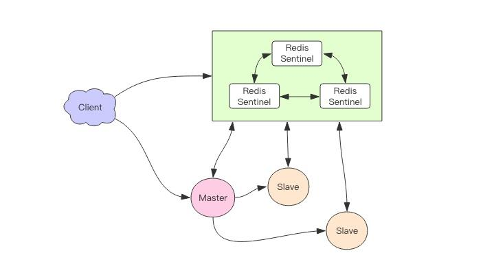
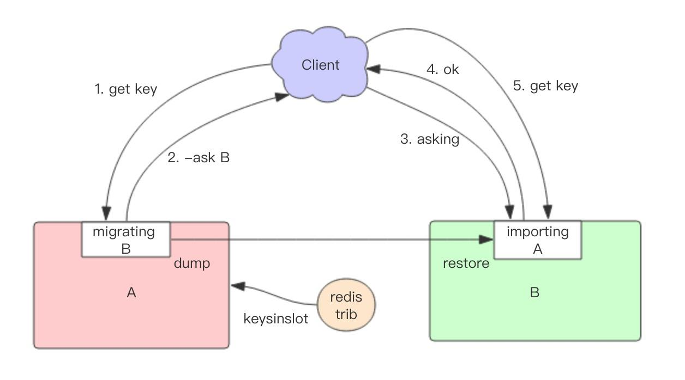

# Redis 分布式

Redis 的集群模式有3种：

- 主从模式：一主多从
- 哨兵模式：主从模式+哨兵
- 集群模式：多主多从

## 主从同步

主从复制是Redis 分布式的基础，Redis 的⾼可⽤离开了主从复制将⽆从进⾏。Redis 通过主从复制保证数据的最终一致性。

Redis 同步⽀持主从同步和从从同步，后者是为了减轻主节点的负担，方式是一样的。

主从同步方式：

- 增量同步
- 全量同步（快照同步）

### 增量同步

基于指令流同步

过程：

1. 主节点将那些对⾃⼰的状态产⽣修改性影响的指令记录在**本地的内存 buffer** 中
2. 主节点**异步**地将 buffer 中的指令同步到从节点
3. 从节点⼀边执⾏同步的指令流，同时向主节点反馈⾃⼰同步的偏移量

内存 buffer 是一个循环数组，数组占满后会从头开始覆盖内容。

当因为网络等原因，主节点中那些没有同步的指令在buffer 中有可能已经被后续的指令覆盖掉了，从节点将⽆法直接通过指令流来进⾏同步，此时就会启动快照同步。

### 快照同步

过程：

1. 主节点使用`bgsave`将内存中全部数据以遍历方式生成快照文件，保存到磁盘上
2. 主节点将快照文件发送给从节点
3. 从节点接收到快照文件后，将当前内存数据清空，并执行全量加载
4. 从节点加载完毕后通知主节点继续进⾏增量同步

在整个快照同步进⾏的过程中，主节点的复制 buffer 还在不停的往前移动，如果快照同步的时间过⻓或者复制 buffer 太⼩，都会导致同步期间的增量指令在复制 buffer 中被覆盖，这就会导致快照同步完成后⽆法进⾏增量复制，然后会再次发起快照同步，如此极有可能会陷⼊快照同步的死循环。因此需要设置一个合适大小的复制 Buffer 。

当节点新加入到集群中，会首先开始一次快照同步。

### 无盘复制

主节点在进⾏快照同步时，会进⾏很重的⽂件 IO 操作，可能会对系统的负载产⽣较⼤影响。特别是当系统正在进⾏ AOF 的 fsync 操作时如果发⽣快照，fsync 将会被推迟执⾏，这就会严重影响主节点的服务效率。

从 Redis 2.8.18 版开始⽀持⽆盘复制。⽆盘复制是指主服务器直接**通过套接字将快照内容发送到从节点**，⽣成快照是⼀个遍历的过程，主节点会**⼀边遍历内存，⼀边将序列化的内容发送到从节点**，从节点还是跟之前⼀样，先将接收到的内容存储到磁盘⽂件中，再进⾏⼀次性加载。


### Wait指令-同步复制

主从同步是异步进行的，但可以通过 Wait 指令变成同步，尽可能确保系统的强⼀致性。

`wait n t`：

- 参数n为从库的数量
- 参数t是时间（毫秒）
- 表示等待 wait 指令之前的所有写操作同步到 N 个从库 (也就是确保 N 个从库的同步没有滞后)，最多等待时间
  t。如果时间 t=0，表示⽆限等待直到 N 个从库同步完成达成⼀致。

```shell
> set key value
OK
> wait 1 0
(integer) 1
```

> wait 指令是 Redis3.0 版本以后才出现的

## 哨兵模式

Redis Sentinel ⼀般由 3-5 个实例组成。

哨兵负责持续监控主从节点的健康，当主节点挂掉时，⾃动选择⼀个最优的从节点切换为主节点。

哨兵选举主节点流程：

1. 哨兵1检测到主节点挂了，会发送消息给其它哨兵确认，等到大多数哨兵均认可，就会判定主节点已下线；（主观下线和客观下线）
2. 从复制的偏移量是否最接近主节点、内存CPU性能、节点id等因素选举一个主节点


客户端来连接集群时，会⾸先连接哨兵，通过哨兵来查询主节点的地址，然后再去连接主节点进⾏数据交互。



哨兵通过2个选项限制主从延迟过⼤，避免主节点宕机造成数据过多丢失：

- `min-slaves-to-write 1`：表示主节点必须⾄少有⼀个从节点在进⾏正常复制，否则就停⽌对外写服务，丧失可⽤性
- `min-slaves-max-lag 10`：表示如果 10s 没有收到从节点的反馈，就意味着从节点同步不正常，要么⽹络断开了，要么⼀直没有给反馈

哨兵模式局限性：

- 写性能受限于主节点
- 所有节点均需存储所有数据


## Redis Cluster

特点：

- 去中心化。每个实例都保存key槽位信息。
- 集群内部使用⼆进制协议相互交互集群信息。
- 集群内部会相互检测节点状态，如离线、新加入。
- 不支持事务；mget ⽅法要慢很多，被拆分成了多个 get 指令；rename ⽅法不再是原⼦的，它需要将数据从原节点转移到⽬标节点。

### 槽位配置

客户端来连接集群时，它也会得到⼀份集群的槽位配置信息。这样当客户端要查找某个 key 时，可以直接定位到⽬标节点。

集群默认会对 key 值使⽤ crc16 算法进⾏ hash 得到⼀个整数值，然后⽤这个整数值对 16384 进⾏取模来得到具体槽位。也允许⽤户强制某个 key 挂在特定槽位上，通过在 key 字符串⾥⾯嵌⼊ tag 标记，这就可以强制 key 所挂在的槽位等于 tag 所在的槽位。

当客户端向⼀个错误的节点发出了指令，该节点会发现指令的 key 所在的槽位并不归⾃⼰管理，便会向客户端发送⼀个跳转指令携带⽬标操作的节点地址，告诉客户端去连这个节点去获取数据。

```shell
GET x
-MOVED 3999 127.0.0.1:6381
```

MOVED 指令前⾯有⼀个减号，表示该指令是⼀个错误消息。

客户端收到 MOVED 指令后，要⽴即纠正本地的槽位映射表。后续所有 key 将使⽤新的槽位映射表。


### 迁移

Redis 迁移的单位是槽，Redis ⼀个槽⼀个槽进⾏迁移，当⼀个槽正在迁移时，这个槽就处于中间过渡状态。这个槽在原节点的状态为migrating，在⽬标节点的状态为importing，表示数据正在从源流向⽬标。

此时若客户端发起请求时，错误的节点会返回一个`-ask`指令，并带有目的节点的地址，客户端向目的节点发起`asking`指定，而不是直接请求。因此此时未迁移完成，key在槽位配置里不属于该节点，那么该节点会重定向到其它节点，便于导致循环请求。`asking`指定强制让节点处理指令。




数据迁移过程：从源节点获取内容（dump） => 存到⽬标节点（restore） => 从源节点删除内容

这⾥的**迁移过程是同步的**，在⽬标节点执⾏指令到原节点删除key之间，原节点的主线程会处于阻塞状态，直到key被成功删除。

在集群环境下业务逻辑要尽可能避免⼤key的产⽣，避免原节点和⽬标节点卡顿，影响集群稳定。


### 集群间探测

Redis 集群节点采⽤ Gossip 协议来⼴播⾃⼰的状态以及⾃⼰对整个集群认知的改变。

若某节点发现一个节点失联了，就会发送广播到整个集群，其它节点也就可以收到这点失联信息。如果⼀个节点收到了某个节点失联的数量已经达到了集群的⼤多数，就可以标记该节点为确定下线状态，然后向整个集群⼴播，强迫其它节点也接收该节点已经下线的事实，并⽴即对该失联节点进⾏主从切换。