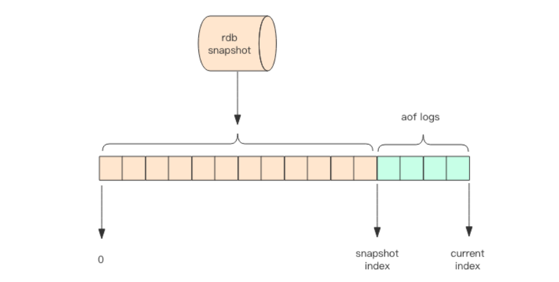

# Redis持久化

Redis 的持久化是通过 fork 一个进程来持久化的，而不是使用工作线程，也不是在进程内新开一个线程。

Redis 数据库在进行写操作时到底做了哪些事？主要有下面五个过程：

1.  客户端向服务端发送写操作（数据在客户端的内存中）。
2.  数据库服务端接收到写请求的数据（数据在服务端的内存中）。
3.  服务端调用write这个系统调用，将数据往磁盘上写（数据在系统内存的缓冲区中）。
4.  操作系统将缓冲区中的数据转移到磁盘控制器上（数据在磁盘缓存中）。
5.  磁盘控制器将数据写到磁盘的物理介质中（数据真正落到磁盘上）。

Redis 持久化机制有 RDB 和 AOF 两种。

- RDB：快照
- AOF：连续的增量备份，记录的是内存数据修改的指令记录文本  

## RDB 持久化

### 原理

RDB 保存的是快照，即某个时刻 Redis 内存中的所有数据。快照是内存数据的二进制序列化形式，在存储上非常紧凑。由于是二进制的，所以使用 RDB 日志来重启恢复数据速度会很快，同时也可以将快照复制到其它 Redis 从节点完成数据备份。

进行 RDB 持久化的时候会 fork 一个产生一个子进程，子进程进行持久化操作，父进程继续处理客户端的请求。父子进程一开始共享内存里同样的数据段和代码段，即虚拟内存层面父子进程映射到一个同样的物理内存中。

子进程做数据持久化，它不会修改现有的内存数据结构，它只是对数据结构进行遍历读取，然后序列化写到磁盘中。  父进程在写数据时会使用操作系统的`copy or write`机制，对共享的数据端页面进行分离，所以持久化时内存占用不是立即增长到2倍，而是逐渐增长，同时在实际情况会有许多比例的冷数据，所以只有少部分的页面会被分离，一般不会增长到2倍。

注：Redis 中每个页面大小为4K

>   Copy or Write：
>
>   fork 之后，kernel把父进程中所有的内存页的权限都设为read-only，然后子进程的地址空间指向父进程。当父子进程都只读内存时，相安无事。当其中某个进程写内存时，CPU硬件检测到内存页是read-only的，于是触发页异常中断（page-fault），陷入kernel的一个中断例程。中断例程中，kernel就会**把触发的异常的页复制一份**，于是父子进程各自持有独立的一份。

### 优劣

优势：

1.  二进制格式，恢复速度快
2.  方便主从节点备份
3.  RDB 可以最大化 Redis 的性能：父进程在保存 RDB 文件时唯一要做的就是 fork 出一个子进程，然后这个子进程就会处理接下来的所有保存工作，父进程无须执行任何磁盘操作。

劣势：

1.  安全性较低，如果系统发生故障，将会丢失最后一次创建快照之后的数据。
2.  如果数据量很大，保存快照的时间会很长，挤占操作系统的资源。

## AOF持久化

AOF 日志记录的是内存数据修改的指令记录文本（文本形式），AOF文件其实可以认为是Redis写操作的日志记录文件。

>   注：不是快照也不是完全的写操作，而是类似于快照的命令。比如a自增100次，只会保存它最后的值

AOF 日志在长期的运行过程中会变的无比庞大，数据库重启时需要加载 AOF 日志进行指令重放，这个时间就会无比漫长。所以需要定期进行 AOF 重写，给 AOF 日志进行瘦身。  

Redis 会在收到客户端修改指令后，先进行参数校验，如果没问题，就立即将该指令文本存储到 AOF 日志中，也就是先存到磁盘，然后再执行指令。这样即使遇到突发宕机，已经存储到 AOF 日志的指令进行重放一下就可以恢复到宕机前的状态。  

### AOF 重写

Redis 提供了 `bgrewriteaof` 指令用于对 AOF 日志进行瘦身。其原理就是开辟一个子进程对内存进行遍历转换成一系列 Redis 的操作指令，序列化到一个新的 AOF 日志文件中。序列化完毕后再将操作期间发生的增量 AOF 日志追加到这个新的 AOF 日志文件中，追加完毕后就立即替代旧的 AOF 日志文件了。

如旧的 AOF 日志文件为 aof.t，新的 AOF 文件为 aof_new.t，将 aof_new.t 重命名为 aof.t，便完成了文件的替换。

### 同步

AOF 日志是以文件的形式存在的，当程序对 AOF 日志文件进行写操作时，实际上是将内容写到了一个内核为文件描述符分配的内存缓存中（缓冲区），然后内核再异步地将脏数据刷到磁盘完成实际的持久化。（默认由操作系统决定什么时候刷新到磁盘？）

因此，如果没有即时将缓冲区的脏数据刷到磁盘，那么突然宕机就会损失这些数据。

Linux 的 `glibc` 提供了 `fsync(int fd)` 函数，可以将指定文件的内容强制从内核缓存刷到磁盘。  

AOF 持久化需要设置同步选项（即什么时候调用 `fsync`），从而确保写命令同步到磁盘文件上的时机。有以下同步选项：

|   选项   |           同步频率           |
| :------: | :--------------------------: |
|  always  |       每个写命令都同步       |
| everysec | 每秒同步一次（周期1s可配置） |
|    no    |   让操作系统来决定何时同步   |

+   always：选项会严重减低服务器的性能；
+   everysec：可以保证系统崩溃时只会丢失一秒左右的数据，这是在数据安全性和性能之间做了一个折中，在保持高性能的同时，尽可能使得数据少丢失；
+   no：并不能给服务器性能带来多大的提升，而且也会增加系统崩溃时数据丢失的数量，很不安全。

### 优劣

优势：

1. 安全性较高，丢失数据较少

劣势：

1. 文本格式，恢复效率低
2. AOF 日志会过于庞大

## Redis4.0的混合持久化

重启 Redis 时，很少使用 RDB 来恢复内存状态，因为会丢失大量数据。通常使用 AOF 日志重放，但是重放 AOF 日志性能相对来说要慢很多，这样在 Redis 实例很大的情况下，启动需要花费很长的时间。

Redis 4.0 为了解决这个问题，带来了一个新的持久化选项——混合持久化。将 RDB 文
件的内容和增量的 AOF 日志文件存在一起。这里的 AOF 日志不再是全量的日志，而是自
持久化开始到持久化结束的这段时间发生的增量 AOF 日志，通常这部分 AOF 日志很小。  

于是在 Redis 重启的时候，可以先加载 rdb 的内容，然后再重放增量 AOF 日志就可以完全替代之前的 AOF 全量文件重放，重启效率因此大幅得到提升。  

## Q&A

Q1：RDB 触发的时间？

根据配置文件中的触发条件。

默认1分钟内至少发生10000次keys变化，或者15分钟内至少发生100次keys变化，或者1小时内至少发生1次keys变化。

## 参考

- https://blog.csdn.net/u011784767/article/details/76824822
- 《Redis深度历险》

