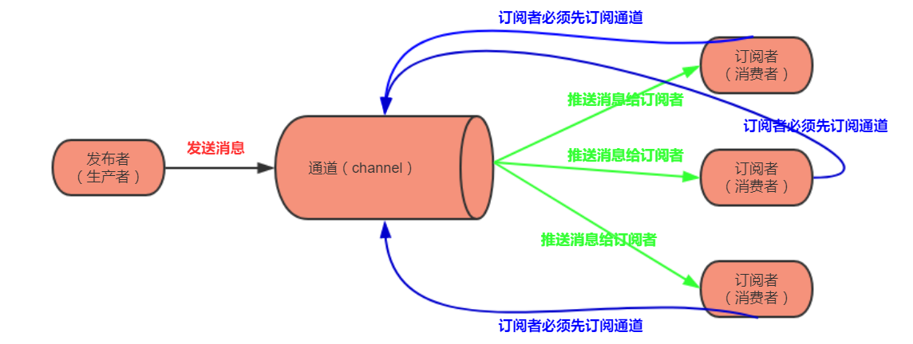

# redis pub/sub

# 简介

pub即publish，发布；sub即subscribe，订阅。redis的发布/订阅模式可以模拟一般的消息队列机制。

pub/sub的实现需要一个消息发送和接收的通道，只有当订阅者订阅了这个通道，才可以接收到发送的消息



pub/sub是两个不同的客户端，在系统中是两个进程

# redis中实现发布/订阅

客户端A先使用`subscribe`命令订阅通道ch

```shell
127.0.0.1:6379> subscribe ch
Reading messages... (press Ctrl-C to quit)
1) "subscribe"
2) "ch"
3) (integer) 1

```

客户端B的发布者推送message到通道ch，1表示有一个订阅者

```shell
127.0.0.1:6379> publish ch 'hello, world'
(integer) 1
```

客户端A接收到message

```shell
127.0.0.1:6379> subscribe ch
Reading messages... (press Ctrl-C to quit)
1) "subscribe"
2) "ch"
3) (integer) 1
1) "message"
2) "ch"
3) "hello, world"
```

第一个为消息类型，第二个为通道名，第三个为消息内容

# 代码实现

在代码中实现其实也很好理解，要运行两个程序，一个sub，一个pub。当然也可以运行一个程序，sub/pub用两个不同的线程来实现。

go连接redis的第三方库有很多，其中`go-redis/redis`和`redigo`算是用的比较多的。

我们选择使用的是 [github.com/go-redis/redis](https://github.com/go-redis/redis) 这个库，因为它的star数较多且更新的比较及时

>   [官方文档](https://godoc.org/github.com/go-redis/redis)

很简单的快速入门示例

```go
package main

import (
    "fmt"

    "github.com/go-redis/redis/v7"
)

func main() {
    client := redis.NewClient(&redis.Options{
        Addr:     "localhost:6379",
        Password: "", // no password set
        DB:       0,  // use default DB
    })  
    err := client.Set("key", "value", 0).Err()
    if err != nil {
        panic(err)
    }   

    val, err := client.Get("key").Result()
    if err != nil {
        panic(err)
    }
    fmt.Println("key", val)

    val2, err := client.Get("key2").Result()
    if err == redis.Nil {
        fmt.Println("key2 does not exist")
    } else if err != nil {
        panic(err)
    } else {
        fmt.Println("key2", val2)
    }   
}
```

## 实现pub/sub

我们先来运行两个程序代码来测试下

先写发送者pub

```go
package main

import (
	"fmt"

	"github.com/go-redis/redis/v7"
)

type RdbClient struct {
	Self *redis.Client
}

var Rdb *RdbClient

func main() {
	fmt.Println("pub start")
	Rdb = &RdbClient{Self: OpenRedisClient()}
	defer Rdb.Self.Close()

	for {
		var s string
		fmt.Scanf("%s", &s)
		fmt.Println(s)
		err := Rdb.Self.Publish("channel", s).Err()
		if err != nil {
			panic(err)
		}
	}
}

func OpenRedisClient() *redis.Client {
	return redis.NewClient(&redis.Options{
		Addr:     "127.0.0.1:6379",
		Password: "",
		DB:       0,
	})
}

```

再写订阅者sub

```go
package main

import (
	"fmt"

	"github.com/go-redis/redis/v7"
)

var Rdb *redis.Client

func main() {
	fmt.Println("sub start")
	Rdb = OpenRedisClient()
	defer Rdb.Close()

	sub := Rdb.Subscribe("channel")

	ch := sub.Channel()

	for msg := range ch {
		fmt.Println(msg.Channel, msg.Payload)
	}
}

func OpenRedisClient() *redis.Client {
	return redis.NewClient(&redis.Options{
		Addr:     "127.0.0.1:6379",
		Password: "",
		DB:       0,
	})
}
```

这样就完成一个简单的发布订阅模式了

## go-redis/redis库

对于这个第三方库有些地方还是需要注意下

使用NewClient()返回一个Client对象

```go
func NewClient(opt *Options) *Client
```

使用client的Subscribe方法返回一个PubSub类型

```go
func (c *Client) Subscribe(channels ...string) *PubSub
```

使用Channel方法能获得一个传递Message类型的通道

```go
func (c *PubSub) Channel() <-chan *Message
```

而Message类型如下

```go
type Message struct {
    Channel string //通道
    Pattern string
    Payload string //内容
}
```

可知它只能传递string类型，对于更复杂的类型（如结构体），只能用Receive()

```go
func (c *PubSub) Receive() (interface{}, error)
```

通道有一个好处就是能连续的接收

```go
ch := sub.Channel()
for msg := range ch {
    fmt.Println(msg.Payload)
}
```

如果要使用Receive()的话只能开一个循环

```go
for {
    msg, err := sub.Receive()
    // ...
}
```

如何优化需要再进一步去思考